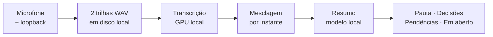

# Cronista

Grava reuniões direto do computador, transcreve **localmente** e gera resumos estruturados em português. Sem bot entrando na chamada, sem cota de uso, sem mensalidade, e sem o áudio sair da máquina.

*Cronista: quem registra o que aconteceu, na ordem em que aconteceu.*

> ## Estado atual: especificação
>
> **Ainda não há código.** Este repositório contém, por ora, a engenharia de requisitos e a especificação técnica completas. A implementação começa pela Fase 1 do [roadmap](docs/15-roadmap.md).

## Por que existe

Ferramentas de IA para reunião, em geral, cobram mensalidade ou limitam o recurso principal no plano gratuito, e enviam o áudio da reunião para a nuvem do fornecedor.

Existem projetos open-source que resolvem um problema semelhante, como [Meetily](https://github.com/Zackriya-Solutions/meetily) e [Hyprnote](https://github.com/fastrepl/hyprnote), ambos locais e de código aberto — nenhum dos dois é descartado aqui por deficiência técnica. O foco deste projeto é outro: **qualidade de transcrição e resumo em português brasileiro, com vocabulário de domínio**, área em que ferramentas com foco no inglês tendem a ter desempenho mais fraco.

Se esse foco se traduz em vantagem real é uma pergunta empírica. Há um [plano de testes](docs/14-plano-de-testes.md) que mede isso, com métrica objetiva de transcrição (WER) e rubrica comparativa de resumo contra o Notion AI. O resultado é publicado aqui, **inclusive se for desfavorável**.

## Como funciona

Duas trilhas de áudio gravadas separadamente, microfone e saída do sistema, dão a separação entre "você" e "os outros" **sem diarização**, de graça e sem erro de atribuição. Cada trilha é transcrita na GPU local e mesclada por instante.



**A gravação nunca depende da API.** O áudio vai para o disco antes de qualquer chamada de rede. Se o banco estiver fora do ar, a reunião é gravada do mesmo jeito e o registro se completa depois. Áudio de reunião não se regrava, e essa é a única falha irreversível do sistema. Ver [ADR-0012](docs/adr/0012-gravacao-em-disco-antes-da-api.md).

## Pilha

| Camada | Escolha |
|---|---|
| Captura | WASAPI com loopback, 16 kHz mono, duas trilhas |
| Transcrição | faster-whisper `large-v3` quantizado, em container com GPU via WSL2 |
| Resumo | LangChain com Ollama local; provedor remoto opcional |
| API | FastAPI, JWT de usuário único |
| Banco | PostgreSQL com busca `tsvector` e stemming de português |
| Interface | Linha de comando primeiro; desktop na Fase 8 |

## Documentação

### Engenharia de requisitos

| Documento | Conteúdo |
|---|---|
| [01 · Documento de Visão](docs/01-documento-de-visao.md) | Problema, posicionamento, recursos, restrições, não-objetivos |
| [02 · Glossário](docs/02-glossario.md) | Termos do domínio |
| [03 · Requisitos](docs/03-requisitos.md) | 31 funcionais e 22 não-funcionais, por FURPS+ |
| [04 · Modelo de Casos de Uso](docs/04-modelo-de-casos-de-uso.md) | Atores e diagrama |
| [05 · Detalhamento dos Casos de Uso](docs/05-detalhamento-casos-de-uso.md) | 11 casos de uso, 22 fluxos de exceção |
| [06 · Matriz de Rastreabilidade](docs/06-matriz-rastreabilidade.md) | Cobertura recurso, requisito, caso de uso, teste |

### Especificação técnica

| Documento | Conteúdo |
|---|---|
| [07 · Arquitetura](docs/07-arquitetura.md) | Componentes, implantação, fluxos, degradação |
| [08 · Modelo de Dados](docs/08-modelo-de-dados.md) | Esquema, estados, entidade-relacionamento, retenção |
| [09 · API](docs/09-api.md) | Contrato dos endpoints |
| [10 · Autenticação](docs/10-autenticacao.md) | JWT, postura de exposição |
| [11 · Linha de Comando](docs/11-cli.md) | Comandos e o que funciona offline |
| [12 · Transcrição](docs/12-transcricao.md) | Pipeline, modelo, vocabulário de domínio |
| [13 · Resumo](docs/13-resumo.md) | Cadeia, formato de saída, transcrições longas |

### Processo

| Documento | Conteúdo |
|---|---|
| [14 · Plano de Testes](docs/14-plano-de-testes.md) | 40 casos de teste, WER, rubrica de resumo |
| [15 · Roadmap](docs/15-roadmap.md) | Nove fases com critério de pronto |
| [16 · Nome](docs/16-nome.md) | Candidatos e procedimento de renomeação |
| [17 · Identidade Visual e Animação do CLI](docs/17-identidade-visual-cli.md) | Rich, barras de gradiente, papéis semânticos de cor |
| [ADRs](docs/adr/) | 16 decisões, cada uma com gatilho de reversão |
| [Referência Rich](docs/referencia-rich.md) | Guia técnico de implementação — não é spec, é atalho pra não redescobrir API |

## Decisões

Cada decisão técnica tem registro com contexto, consequências **negativas** e a condição concreta que a tornaria errada.

Duas merecem destaque por serem incomuns:

**[ADR-0005 · LangChain](docs/adr/0005-langchain-na-camada-de-resumo.md)** foi adotado *contra* a recomendação técnica registrada no próprio documento. O ADR preserva o desacordo em vez de reescrever a história.

**[ADR-0012 · Gravação antes da API](docs/adr/0012-gravacao-em-disco-antes-da-api.md)** é a única exceção deliberada à arquitetura, e o único ADR sem gatilho de reversão.

## Ambiente

Windows 11, Python 3.13, GPU NVIDIA, Docker Engine nativo no WSL2, Ollama.

A captura de loopback foi verificada nesta máquina antes do planejamento. O script está em [`scripts/check_audio.py`](scripts/check_audio.py) e é o primeiro passo de qualquer instalação.

```bash
python scripts/check_audio.py
```

### Subir o ambiente

**Por opção, nada sobe automaticamente no logon.** Abrir o terminal do WSL é o gesto que liga o ambiente:

```bash
wsl
```

A distro sobe, o systemd inicia o Docker e os containers voltam sozinhos (`restart: unless-stopped`). O `docker compose up -d` só é necessário na primeira vez.

**A API não está no compose** — sobe à parte:

```bash
uvicorn cronista.api.main:app --host 127.0.0.1 --port 8000
```

Para derrubar tudo: `wsl --shutdown`.

**Esquecer de subir não custa uma reunião.** Gravar não depende de API, banco nem WSL. O áudio vai para o disco e o registro se completa depois, com `cronista sync`. É exatamente o cenário que motivou o [ADR-0012](docs/adr/0012-gravacao-em-disco-antes-da-api.md): ninguém confere container antes de entrar numa reunião.

---

*Documentação em português por decisão deliberada: o projeto é para uso em português e a clareza para quem o mantém vale mais que alcance internacional. Identificadores de código e esquema seguem em inglês.*
