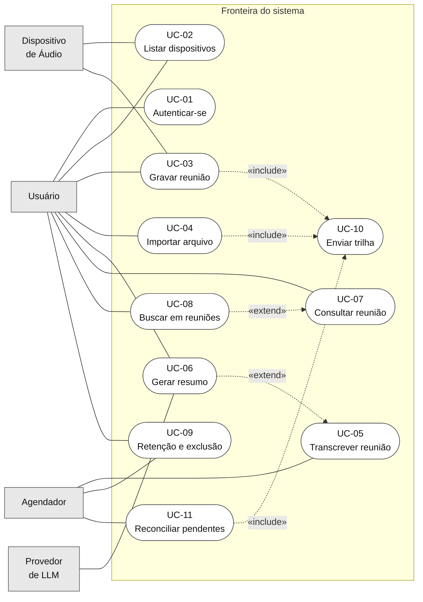
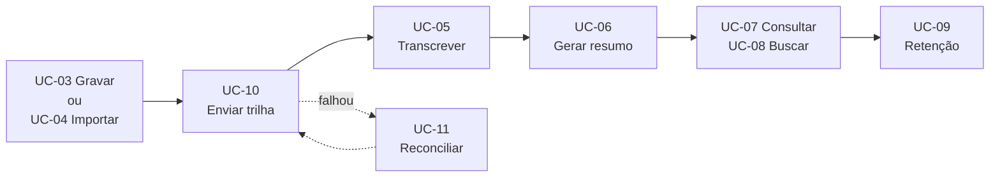

# Modelo de Casos de Uso

> **Versão:** 1.0 · **Última atualização:** 2026-08-12
> Deriva de [03-requisitos.md](03-requisitos.md). Detalhado em [05-detalhamento-casos-de-uso.md](05-detalhamento-casos-de-uso.md).

## 1. Atores

| Ator | Tipo | Papel |
|---|---|---|
| **Usuário** | Primário | Único operador humano. Inicia gravações, consulta o acervo, pede resumos |
| **Dispositivo de Áudio** | Apoio | Hardware que fornece o sinal do microfone e o loopback da saída |
| **Provedor de LLM** | Apoio | Serviço que gera o resumo. Ollama local por padrão; provedor remoto opcional |
| **Agendador** | Apoio | Dispara comportamento por tempo ou por evento de inicialização: transcrição da fila, reconciliação de pendências, política de retenção |

### 1.1 Sobre a escolha dos atores

Duas decisões de modelagem que merecem justificativa, já que ambas admitem alternativa:

**O motor de transcrição não é ator.** Ele executa como biblioteca dentro do processo do worker, que é parte do sistema. Modelá-lo como ator externo sugeriria uma fronteira que não existe. O **Provedor de LLM**, ao contrário, é processo separado com interface de rede: este é externo de fato.

**O Agendador é ator, e não "o sistema chamando a si mesmo".** Transcrição, reconciliação e retenção não são iniciadas pelo Usuário: acontecem por decorrência de tempo ou de estado. Sem um ator que represente esse disparo, esses casos de uso ficariam sem iniciador, ou seriam incorretamente atribuídos ao Usuário.

## 2. Casos de uso

| ID | Caso de uso | Ator iniciador | Requisitos |
|---|---|---|---|
| **UC-01** | Autenticar-se | Usuário | RF-25, RF-26, RF-27, RF-28 |
| **UC-02** | Listar dispositivos de áudio | Usuário | RF-01 |
| **UC-03** | Gravar reunião | Usuário | RF-02 a RF-08 |
| **UC-04** | Importar arquivo de áudio | Usuário | RF-09 |
| **UC-05** | Transcrever reunião | Agendador | RF-10 a RF-15 |
| **UC-06** | Gerar resumo | Usuário | RF-16 a RF-19 |
| **UC-07** | Consultar reunião | Usuário | RF-20, RF-21, RF-22 |
| **UC-08** | Buscar em reuniões | Usuário | RF-23, RF-24 |
| **UC-09** | Aplicar retenção e excluir reunião | Agendador, Usuário | RF-29, RF-30 |
| **UC-10** | Enviar trilha de áudio | n/d (incluído) | RF-06, RF-07 |
| **UC-11** | Reconciliar reuniões pendentes | Agendador | RF-08 |

### 2.1 Dois casos de uso que não estavam previstos

O planejamento inicial identificou nove casos de uso. Ao detalhar os fluxos, dois comportamentos ficaram sem dono, o que é exatamente o que o detalhamento serve para revelar:

**UC-10 · Enviar trilha de áudio.** Gravação ao vivo e importação de arquivo terminam no mesmo ponto: uma trilha de áudio precisa ser registrada e associada a uma reunião. Deixar isso duplicado em UC-03 e UC-04 esconderia que os dois caminhos convergem, que é justamente o que faz a importação ser barata de implementar.

**UC-11 · Reconciliar reuniões pendentes.** RF-08 exige reenviar registros que falharam, e RNF-R01 exige que nenhuma reunião se perca. Nenhum caso de uso da lista original cobria isso. Sem UC-11, o requisito mais forte do sistema ficaria sem comportamento correspondente.

## 3. Diagrama de casos de uso

> **Nota de notação.** O Mermaid não possui diagrama de casos de uso nativo: não há notação de ator em boneco nem de caso de uso em elipse. O diagrama abaixo é uma **aproximação declarada**: atores como retângulos à esquerda, casos de uso como formas arredondadas dentro da fronteira do sistema, associações como linhas sem seta e as relações «include» e «extend» como setas tracejadas rotuladas. A escolha por Mermaid foi deliberada, ver [adr/0013-mermaid-para-diagramas.md](adr/0013-mermaid-para-diagramas.md).

### 3.1 Leitura das relações

| Relação | Significado |
|---|---|
| UC-03, UC-04, UC-11 «include» UC-10 | Os três caminhos que produzem áudio terminam no mesmo comportamento de envio. É obrigatório e sempre executado |
| UC-08 «extend» UC-07 | A partir de um resultado de busca, o usuário **pode** abrir a reunião correspondente. Comportamento opcional, condicionado à escolha do usuário |
| UC-06 «extend» UC-05 | Concluída a transcrição, o resumo **pode** ser disparado automaticamente conforme configuração. Opcional e condicionado |

## 4. Fluxo de vida de uma reunião

Os casos de uso não são independentes: encadeiam-se ao longo do estado da reunião. O diagrama de estados completo, com falhas e transições de recuperação, está em [08-modelo-de-dados.md](08-modelo-de-dados.md).

## 5. Rastreabilidade

Cada caso de uso é detalhado em [05-detalhamento-casos-de-uso.md](05-detalhamento-casos-de-uso.md), com fluxos alternativos, fluxos de exceção e regras de negócio. A cobertura recurso → requisito → caso de uso → caso de teste é verificada em [06-matriz-rastreabilidade.md](06-matriz-rastreabilidade.md).
