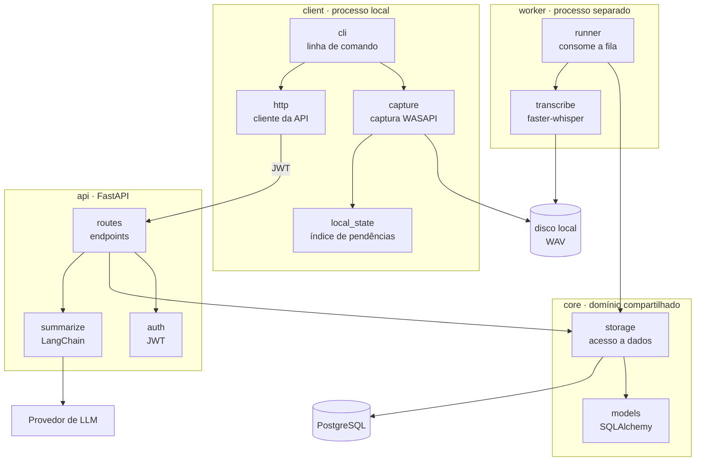
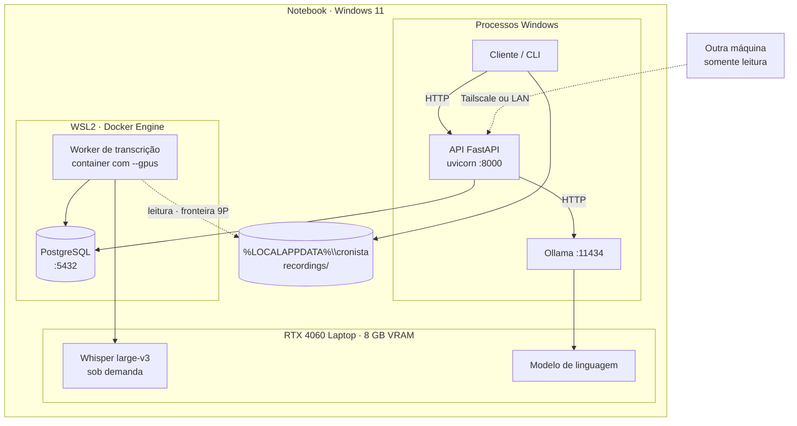
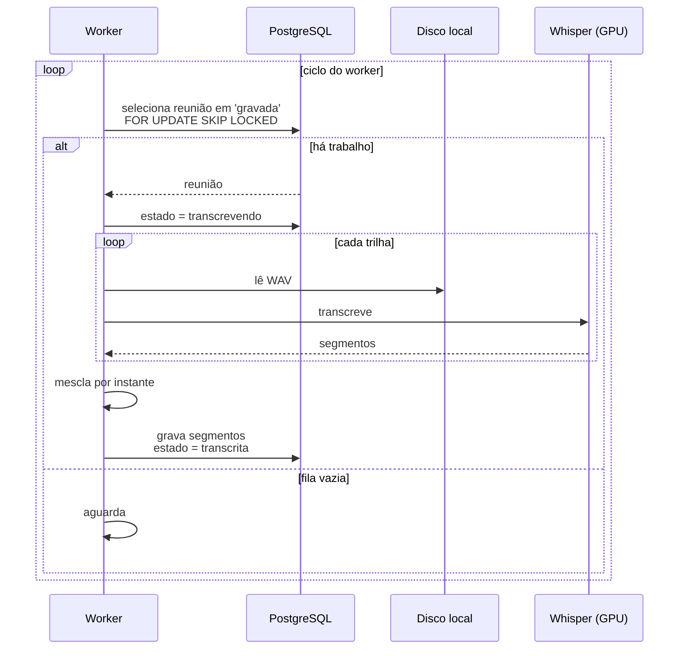
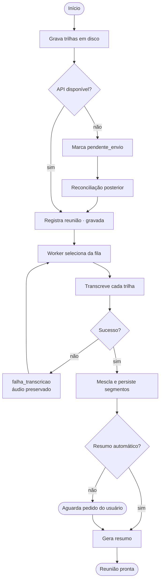

# Arquitetura

> **Versão:** 1.1 · **Última atualização:** 2026-08-22
> Decisões correspondentes: [0010](adr/0010-api-como-centro.md), [0012](adr/0012-gravacao-em-disco-antes-da-api.md), [0002](adr/0002-faster-whisper-local.md)

## 1. Princípios

Três regras governam o desenho. Todas derivam de requisitos, não de preferência.

**1. A API é o centro do estado.** Registro de reuniões, transcrições, resumos, busca e consulta passam pela API. Cliente e futura interface desktop são consumidores HTTP, não donos de dados.

**2. A gravação é a exceção deliberada à regra 1.** Áudio de reunião não se regrava: é a única falha irreversível do sistema (RNF-R01). Por isso a captura escreve em disco local antes de qualquer chamada de rede e **nunca** depende da API para iniciar ou continuar. O registro é posterior e reconciliável.

**3. Processos separados por recurso disputado.** O worker de transcrição mantém o modelo carregado em memória de vídeo e satura GPU e CPU. Rodá-lo dentro da API violaria RNF-P04 (máquina utilizável durante a gravação) e tornaria a API refém do ciclo de vida do modelo.

## 2. Componentes



### 2.1 Responsabilidades

| Componente | Responsabilidade | Não faz |
|---|---|---|
| `client/capture` | Capturar as duas trilhas e escrever WAV incrementalmente | Falar com a API; transcrever |
| `client/local_state` | Índice em disco das reuniões gravadas e seu estado de envio | Ser fonte de verdade do acervo |
| `client/http` | Autenticar, renovar token, enviar e consultar | Regra de negócio |
| `client/cli` | Interface de linha de comando | Lógica de captura ou de rede |
| `api/routes` | Contrato HTTP, validação, códigos de erro | Transcrever |
| `api/auth` | Emitir e validar token | Gerenciar usuários (não há) |
| `api/summarize` | Orquestrar a cadeia de resumo | Escolher modelo em tempo de código |
| `worker/runner` | Selecionar trabalho da fila e conduzir o ciclo | Expor interface de rede |
| `worker/transcribe` | Transcrever trilhas e mesclar | Persistir |
| `core/models` | Entidades e esquema | Acesso HTTP |
| `core/storage` | Consultas e persistência | Regra de apresentação |

### 2.2 Regra de dependência

```
client  →  core.models          (apenas tipos compartilhados)
api     →  core.*
worker  →  core.*
core    →  nada do projeto
```

`core` não importa `api`, `client` nem `worker`. Essa é a restrição que mantém o domínio testável sem subir servidor, e o que permitirá acrescentar a interface desktop sem tocar em regra de negócio.

## 3. Implantação

Tudo em uma máquina. A topologia não é óbvia porque atravessa Windows, WSL2 e GPU.



**O worker roda em container, não como processo Windows** ([ADR-0014](adr/0014-worker-em-container-com-gpu.md)). A razão é isolamento de dependência: `ctranslate2` exige versões específicas de CUDA e cuDNN, que a imagem carrega e o ambiente da API nunca vê. A GPU chega ao container pelo caminho paravirtualizado do WSL2, com o NVIDIA Container Toolkit.

**A seta tracejada para o disco é o único ponto lento do desenho.** O acervo fica no Windows e o container o lê atravessando o compartilhamento 9P entre a máquina virtual e o hospedeiro. Isso custa segundos por trilha, e é aceito de propósito: guardar o áudio dentro do WSL apenas transferiria a lentidão para a **escrita**, que é a operação irreversível.

**Ponto de atenção de VRAM: é a restrição que governa o desenho.** A GPU tem 8 GB, mas o desktop do Windows já consome ~1,5 a 2 GB (medido), deixando **~6,3 GB de fato disponíveis**. Whisper (4 a 5 GB) e o modelo de linguagem (5 a 6 GB) não cabem simultaneamente, e o Whisper sozinho já ocupa a maior parte do que sobra. **Transcrever e resumir são operações mutuamente exclusivas nesta máquina.**

Duas consequências, ambas obrigatórias:

1. O worker **carrega o modelo sob demanda e o libera após período ocioso**, em vez de mantê-lo residente. Prender 4 a 5 GB permanentemente economizaria cerca de vinte segundos de carregamento e custaria a memória que o resumo precisa.
2. O resumo automático só dispara **depois** que a transcrição liberou o modelo.

> **Status: implementado** (`cronista/worker/runner.py`, `trigger_pending_summaries()`; `ModelManager.is_loaded()`). O worker, quando a fila de transcrição está vazia **e** o Whisper não está carregado, chama `POST /meetings/{id}/summarize` na API pra cada reunião `transcribed` pendente — nunca `summary_failed`, pra não bombardear um provedor fora do ar a cada ciclo de poll; recuperar disso continua sendo `cronista resumir <id>`, pedido explícito (UC-06). Autenticado com um token de serviço de vida longa (`cronista.api.security.issue_service_token()`, gerado com `scripts/mint_worker_token.py`), não um login de usuário — desligado por padrão até existir token de verdade (`WORKER_AUTO_SUMMARIZE=false`). **Validado de ponta a ponta contra infraestrutura real**: um container na rede do compose alcança a API no host Windows via `host.docker.internal` sem configuração extra (Docker Desktop resolve sozinho), o token minerado autenticou de verdade contra a API rodando, e `trigger_pending_summaries()` processou duas reuniões reais na mesma chamada — uma falhou (503, ficou `summary_failed`, resíduo de teste anterior) sem impedir a outra de terminar `summarized` com um resumo real gerado pelo Ollama.

Configuração e limites em [12-transcricao.md](12-transcricao.md).

## 4. Fluxos

### 4.1 Gravação, incluindo o caminho de falha

O fluxo mais importante do sistema. O ramo `else` é o que materializa RNF-R01.

```mermaid
sequenceDiagram
    actor U as Usuário
    participant C as Cliente
    participant D as Disco local
    participant A as API
    participant DB as PostgreSQL

    U->>C: iniciar gravação
    C->>D: cria diretório da reunião
    loop enquanto grava
        C->>D: escreve blocos (mic + loopback)
    end
    U->>C: encerrar
    C->>D: fecha os WAV
    Note over C,D: áudio íntegro em disco, RN-08

    C->>A: registrar reunião
    alt API disponível
        A->>DB: cria reunião
        A-->>C: identificador
        C->>A: envia as duas trilhas
        A->>DB: estado = gravada
        A-->>C: confirmação
        C-->>U: reunião registrada
    else API indisponível
        A--xC: falha de conexão
        C->>D: marca pendente_envio
        C-->>U: "áudio salvo; registro pendente"
        Note over C: UC-11 reconcilia depois
    end
```

### 4.2 Transcrição, o banco como fila

Não há Celery, Redis nem broker. O estado da reunião *é* a fila, e o PostgreSQL fornece o travamento necessário.



**Por que isso basta.** A carga é de um usuário e poucas reuniões por dia. `FOR UPDATE SKIP LOCKED` garante que dois workers nunca peguem a mesma reunião, o que já cobre a única condição de corrida real. Introduzir um broker acrescentaria um serviço para operar, um ponto de falha e nenhuma capacidade de que este sistema precise.

### 4.3 Ciclo completo



## 5. Disponibilidade por operação

Consequência direta do princípio 2. Esta tabela é o contrato de degradação do sistema.

| Operação | Exige API | Exige banco | Exige GPU | Exige LLM |
|---|---|---|---|---|
| Listar dispositivos | não | não | não | não |
| **Gravar reunião** | **não** | **não** | não | não |
| Registrar reunião | sim | sim | não | não |
| Reconciliar pendências | sim | sim | não | não |
| Transcrever | não¹ | sim | sim | não |
| Gerar resumo | sim | sim | não | sim |
| Consultar e buscar | sim | sim | não | não |

¹ O worker fala direto com o banco, não com a API.

**Leitura da tabela:** a única linha em negrito é a que não pode falhar. Todas as demais operações são repetíveis: se falharem, tenta-se de novo sem perda.

## 6. Segurança

| Aspecto | Decisão |
|---|---|
| Exposição | A API não vai para a internet aberta. Rede privada (Tailscale) ou LAN, ver [10-autenticacao.md](10-autenticacao.md) |
| Autenticação | JWT, usuário único, credencial em variável de ambiente com hash Argon2 |
| Dados em repouso | Sem criptografia adicional. O disco é do usuário e a superfície é local |
| Áudio | Nunca transita para serviço de terceiro no caminho padrão (RNF-C01) |
| Segredos | Em `.env`, fora do controle de versão |

## 7. Decisões deliberadamente adiadas

| Adiado | Quando reconsiderar |
|---|---|
| Broker de fila | Se houver mais de um worker em máquinas distintas |
| Cache | Se a busca deixar de responder sob 1 segundo |
| Múltiplos usuários | Ver gatilho de reversão em [adr/0011](adr/0011-jwt-usuario-unico.md) |
| Busca semântica | Se a busca textual se mostrar insuficiente. O PostgreSQL comporta `pgvector` sem troca de banco |
| Copiar áudio para dentro do WSL antes de transcrever | Se a fronteira 9P comprometer RNF-P01. Medido em CT-16, não presumido ([ADR-0014](adr/0014-worker-em-container-com-gpu.md)) |
