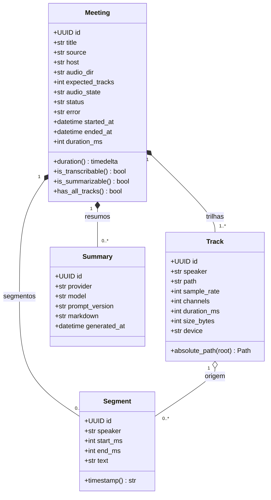
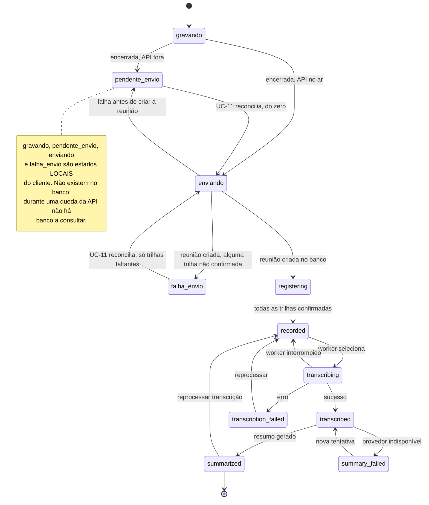
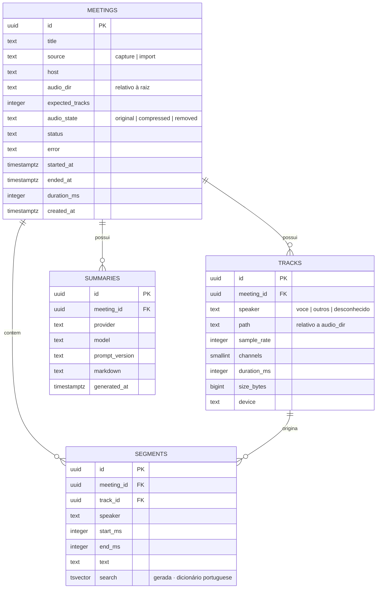

# Modelo de Dados

> **Versão:** 1.0 · **Última atualização:** 2026-08-12
> Decisões correspondentes: [0003](adr/0003-postgres-como-banco.md), [0004](adr/0004-uuid-timestamptz-caminhos-relativos.md), [0009](adr/0009-sqlalchemy-alembic.md)

## 1. Princípio de separação

**O banco guarda metadados e texto. O áudio fica no disco.**

Uma reunião de uma hora em duas trilhas ocupa cerca de 230 MB em WAV; a transcrição correspondente ocupa cerca de 50 KB. Guardar áudio como campo binário incharia o banco, tornaria o backup impraticável e não traria nenhuma capacidade: o áudio é sempre lido inteiro, por caminho, nunca consultado por conteúdo.

O banco armazena a **referência**, sempre relativa a uma raiz configurável, mais a máquina de origem. Caminho absoluto não significa nada em outra máquina, e essa é a razão de RF-07.

## 2. Layout em disco

```
%LOCALAPPDATA%\cronista\
├─ recordings\
│  └─ 2026-08-12_1430_reuniao-comercial\      ← meetings.audio_dir (relativo)
│     ├─ voce.wav                             ← tracks.path
│     └─ outros.wav
└─ pending.json                               ← índice local de pendências
```

`pending.json` é o índice do cliente, não do servidor. Ele existe porque durante uma queda da API não há banco algum para consultar, e ainda assim a reunião precisa ser encontrável. Ver §5.

## 3. Modelo de domínio



**Por que `Track` existe como entidade.** O planejamento inicial previa apenas três tabelas. Ao detalhar UC-10, ficou claro que a trilha tem atributos próprios (falante, caminho, dispositivo de origem, duração) e que a gravação produz duas enquanto a importação produz uma. Embutir isso em colunas fixas de `Meeting` (`mic_path`, `system_path`) travaria o modelo em exatamente dois canais e quebraria na primeira importação.

## 4. Esquema

Convenção: identificadores e valores em inglês. Exceção deliberada em `speaker`, cujos valores (`voce`, `outros`, `desconhecido`) aparecem direto na transcrição lida por humano.

### 4.1 `meetings`

```sql
CREATE TABLE meetings (
    id           uuid        PRIMARY KEY,
    title        text        NOT NULL,
    source       text        NOT NULL CHECK (source IN ('capture', 'import')),
    host         text        NOT NULL,
    audio_dir    text        NOT NULL,
    expected_tracks integer  NOT NULL,
    audio_state  text        NOT NULL DEFAULT 'original'
                             CHECK (audio_state IN ('original', 'compressed', 'removed')),
    status       text        NOT NULL
                             CHECK (status IN ('registering', 'recorded', 'transcribing',
                                               'transcribed', 'summarized',
                                               'transcription_failed', 'summary_failed')),
    error        text,
    started_at   timestamptz NOT NULL,
    ended_at     timestamptz,
    duration_ms  integer,
    created_at   timestamptz NOT NULL DEFAULT now()
);

CREATE INDEX meetings_queue_idx   ON meetings (status, started_at);
CREATE INDEX meetings_started_idx ON meetings (started_at DESC);
```

`meetings_queue_idx` serve à seleção do worker: é o índice da fila (§4.5).

### 4.2 `tracks`

```sql
CREATE TABLE tracks (
    id          uuid        PRIMARY KEY,
    meeting_id  uuid        NOT NULL REFERENCES meetings(id) ON DELETE CASCADE,
    speaker     text        NOT NULL,
    path        text        NOT NULL,
    sample_rate integer     NOT NULL,
    channels    smallint    NOT NULL,
    duration_ms integer,
    size_bytes  bigint,
    device      text,
    created_at  timestamptz NOT NULL DEFAULT now(),
    UNIQUE (meeting_id, speaker)
);
```

`path` é relativo a `meetings.audio_dir`, que por sua vez é relativo à raiz configurada. Dois níveis de indireção, ambos deliberados: mover o acervo inteiro para outro disco não deve exigir tocar em nenhuma linha do banco.

### 4.3 `segments`

```sql
CREATE TABLE segments (
    id         uuid     PRIMARY KEY,
    meeting_id uuid     NOT NULL REFERENCES meetings(id) ON DELETE CASCADE,
    track_id   uuid              REFERENCES tracks(id)   ON DELETE CASCADE,
    speaker    text     NOT NULL,
    start_ms   integer  NOT NULL,
    end_ms     integer  NOT NULL,
    text       text     NOT NULL,
    search     tsvector GENERATED ALWAYS AS (to_tsvector('portuguese', text)) STORED
);

CREATE INDEX segments_meeting_idx ON segments (meeting_id, start_ms);
CREATE INDEX segments_search_idx  ON segments USING GIN (search);
```

**A coluna `search` é o coração da busca.** Ela é gerada e mantida pelo próprio banco, não há trigger para escrever, nem risco de índice divergir do conteúdo. O dicionário `portuguese` aplica stemming: "decidimos", "decidido" e "decisão" colapsam na mesma raiz, e buscar por uma encontra as outras.

Essa é a razão técnica de PostgreSQL ter substituído SQLite no projeto. O mecanismo equivalente do SQLite não faz stemming de português, e num sistema cuja tese é qualidade em pt-BR isso deixaria de ser detalhe.

### 4.4 `summaries`

```sql
CREATE TABLE summaries (
    id             uuid        PRIMARY KEY,
    meeting_id     uuid        NOT NULL REFERENCES meetings(id) ON DELETE CASCADE,
    provider       text        NOT NULL,
    model          text        NOT NULL,
    prompt_version text        NOT NULL,
    markdown       text        NOT NULL,
    generated_at   timestamptz NOT NULL DEFAULT now()
);

CREATE INDEX summaries_meeting_idx ON summaries (meeting_id, generated_at DESC);
```

Relação 1:N, jamais 1:1 (RN-03). Trocar de modelo ou de prompt e perder o resultado anterior impediria saber se houve melhora, e medir isso é o critério de sucesso do projeto ([14-plano-de-testes.md](14-plano-de-testes.md)).

### 4.5 Por que `CHECK` e não `ENUM`

O PostgreSQL oferece tipo enumerado nativo. Não é usado aqui: remover ou renomear um valor de `ENUM` é operação incômoda em migração, e a lista de estados é justamente a parte do modelo com maior chance de mudar enquanto o sistema amadurece. `text` com `CHECK` dá a mesma garantia de integridade e altera-se com uma linha de migração.

## 5. Estados



**`registering` é o estado que faltava.** O fluxo de UC-10 registra a reunião primeiro e envia as trilhas depois; sem um estado intermediário no banco, uma reunião recém-criada teria que mentir que já está `recorded` (arriscando o worker pegá-la sem trilha nenhuma) ou violar a coluna `NOT NULL`. `registering` cobre exatamente a janela entre "a API sabe que a reunião existe" e "todas as trilhas chegaram".

### 5.1 A fronteira entre os dois conjuntos de estado

| Onde | Estados | Fonte de verdade |
|---|---|---|
| Cliente (`pending.json`) | `gravando`, `pendente_envio`, `enviando`, `falha_envio` | Disco local |
| Banco (`meetings.status`) | `registering`, `recorded` … `summary_failed` | PostgreSQL |

A separação não é acidental: se a API está fora, o banco não sabe que a reunião existe. O cliente precisa de um registro próprio para que UC-11 tenha o que reconciliar. Este é o preço concreto do ADR-0012, e ele é pequeno perto de perder uma reunião.

**`falha_envio` distingue-se de `pendente_envio`.** O primeiro significa "a reunião já existe no banco, faltou enviar alguma trilha"; o segundo, "nada foi enviado ainda, nem a reunião". A diferença importa para UC-11: com `falha_envio`, a reconciliação reaproveita o identificador já emitido pela API e reenvia só o que falta (UC-10, FA-01); com `pendente_envio`, ela começa do zero.

### 5.2 O estado é a fila

Não há broker. O worker seleciona trabalho com:

```sql
SELECT * FROM meetings
 WHERE status = 'recorded'
 ORDER BY started_at
   FOR UPDATE SKIP LOCKED
 LIMIT 1;
```

`FOR UPDATE SKIP LOCKED` garante que dois workers jamais peguem a mesma reunião, a única condição de corrida real do sistema. `transcribing → recorded` na inicialização devolve à fila o que ficou preso por interrupção (UC-05, FE-03).

## 6. Diagrama entidade-relacionamento



## 7. Identificadores e tempo

| Escolha | Razão |
|---|---|
| `uuid` (versão 7), gerado na aplicação | Duas máquinas gravando offline produziriam ids sequenciais colidentes. UUIDv7 evita a colisão e, ao contrário das versões anteriores, é ordenável por tempo, o que preserva localidade no índice |
| `timestamptz`, sempre em UTC | Fuso e horário de verão são fonte clássica de defeito. A conversão para hora local é responsabilidade da apresentação |
| Caminhos relativos + `host` | Um caminho absoluto não resolve em outra máquina. Ver RF-07 |

## 8. Retenção de áudio

Política configurável, aplicada por UC-09.

| Parâmetro | Efeito |
|---|---|
| `keep_audio_days` | Idade a partir da qual o áudio é tratado |
| `audio_policy = compress` | Converte para Opus, cerca de 3 MB por hora, contra 230 MB em WAV |
| `audio_policy = delete` | Remove os arquivos e marca `audio_state = 'removed'` |

**Duas salvaguardas:**

1. A política **nunca** toca em reunião cujo estado não seja `transcribed` ou `summarized`. Remover áudio ainda não transcrito destruiria o único dado existente (UC-09, FA-01).
2. A política **nunca** afeta `segments` nem `summaries` (RN-04). O texto é permanente; o áudio é o item volumoso e substituível pela transcrição.

## 9. Migrações

Alembic, com histórico linear. Regras:

- Toda alteração de esquema é uma revisão versionada. Nenhuma alteração manual em produção.
- A revisão inicial cria as quatro tabelas, os índices e a coluna gerada.
- Revisões que alteram `CHECK` de estado devem tratar as linhas existentes explicitamente, nunca por remoção da restrição.

```bash
alembic upgrade head
```

## 10. Backup

Consequência direta de trocar SQLite por PostgreSQL: backup deixou de ser copiar um arquivo.

| Item | Método | Frequência |
|---|---|---|
| Banco | `pg_dump` para arquivo comprimido | Diária, automatizada |
| Áudio | Cópia do diretório `recordings\` | Conforme a política de retenção |
| Segredos | `.env`, fora do controle de versão, guardado à parte | Na mudança |

RNF-R04 exige que a restauração seja **testada**, não apenas configurada. Um backup nunca restaurado é uma suposição, não uma garantia. Ver CT-38.
