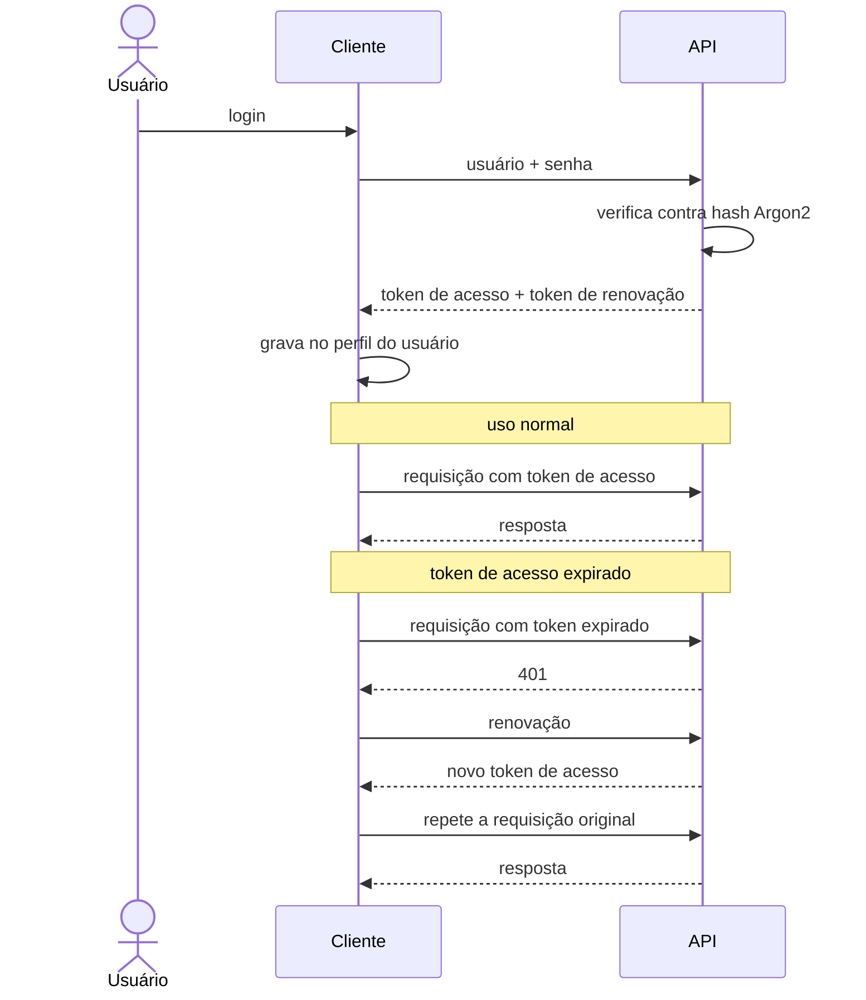

# Autenticação · Contrato

> **Versão:** 1.0 · **Última atualização:** 2026-08-12
> Decisão correspondente: [0011](adr/0011-jwt-usuario-unico.md)

## 1. O que a autenticação protege

**Um único usuário.** Não há cadastro, não há papéis, não há isolamento entre pessoas. A autenticação existe por uma razão específica: a API vai ser alcançável a partir de outra máquina (RP-07), e serviço alcançável sem credencial é serviço aberto.

Isso é escopo declarado, não simplificação temporária. O gatilho para mudar está escrito no ADR-0011.

## 2. Fluxo

A renovação é transparente (UC-01, FA-01). O usuário digita a senha uma vez e não volta a ser interrompido enquanto o token de renovação for válido.

## 3. Parâmetros

| Item | Valor | Razão |
|---|---|---|
| Hash da senha | Argon2id | Lento e caro em memória por projeto, o que encarece força bruta |
| Token de acesso | Vida curta, na casa de dezenas de minutos | Limita a janela de um token vazado |
| Token de renovação | Vida longa, na casa de semanas | Evita pedir senha a cada sessão |
| Assinatura | Segredo simétrico em `.env` | Chave assimétrica não se paga com um emissor e um verificador no mesmo processo |
| Armazenamento no cliente | Arquivo no perfil do usuário, permissão restrita ao dono | Suficiente para superfície local |

Valores exatos ficam em configuração, não fixos em código.

## 4. Postura de exposição

**A API não vai para a internet aberta** (RNF-C06). Isso não é cautela genérica: é o que permite que a autenticação seja tão simples quanto é.

| Cenário | Recomendação |
|---|---|
| Mesma máquina | Escuta apenas em `localhost` |
| Rede local | Escuta na interface da LAN |
| Fora de casa | **Rede privada tipo Tailscale**, nunca porta aberta no roteador |

Com rede privada, não é preciso operar certificado, expor porta, nem defender a superfície contra varredura da internet. A escolha entre LAN e Tailscale segue em aberto e não bloqueia nada — ver [15-roadmap.md](15-roadmap.md).

Se algum dia a API for exposta publicamente, **este documento deixa de valer** e precisa ser revisto por inteiro: limite de tentativas, HTTPS obrigatório, rotação de segredo e auditoria passam a ser necessários. Nenhum deles é necessário hoje.

## 5. O que não existe

Registrado para que a ausência seja lida como decisão, não como esquecimento:

| Ausente | Por quê |
|---|---|
| Cadastro de usuário | Usuário único, credencial em `.env` |
| Recuperação de senha | Sem e-mail, sem segundo canal. Recuperar é editar o `.env` |
| Verificação de e-mail | Não há e-mail |
| Papéis e permissões | Não há mais de um usuário |
| Revogação de token | Vida curta do token de acesso torna a lista de revogação desproporcional. Trocar o segredo invalida tudo |
| Limite de tentativas | Superfície não exposta. **Passa a ser obrigatório** se §4 mudar |

## 6. Regras invioláveis

1. A senha nunca é gravada em log, em disco ou em mensagem de erro.
2. Só o hash é persistido — nunca a senha (RF-28).
3. Erro de login não distingue "usuário inexistente" de "senha errada".
4. Todo endpoint exige token, exceto `/auth/login` e `/health` (RN-10).
5. O segredo de assinatura fica em `.env`, fora do controle de versão.
