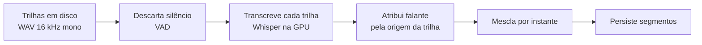

# Transcrição · Contrato

> **Versão:** 1.0 · **Última atualização:** 2026-08-12
> Decisões correspondentes: [0001](adr/0001-captura-local-duas-trilhas.md), [0002](adr/0002-faster-whisper-local.md)

## 1. Pipeline

O pipeline recebe **uma lista de trilhas**, nunca um número fixo. Gravação ao vivo entrega duas; importação entrega uma. Essa é a única razão pela qual UC-04 não exige reescrever nada.

## 2. Captura

| Parâmetro | Valor | Razão |
|---|---|---|
| Taxa de amostragem | 16 kHz | É o que o modelo consome. Gravar acima só gasta disco e obriga a reamostrar |
| Canais | 1 por trilha | Voz não se beneficia de estéreo |
| Formato | WAV PCM 16 bits | Sem compressão durante a captura: codificar em tempo real arrisca a única etapa irreversível |
| Escrita | Incremental, em blocos | A reunião nunca fica acumulada em memória (RNF-P03) |

Duas trilhas, uma por origem:

| Trilha | Origem | Falante |
|---|---|---|
| `voce.wav` | Microfone | `voce` |
| `outros.wav` | Loopback da saída | `outros` |

**A atribuição de falante vem da origem do sinal, nunca de análise de conteúdo** (RN-01). É por isso que o sistema não precisa de diarização: a separação já aconteceu no hardware, e é exata por construção.

Custo em disco: cerca de 115 MB por hora por trilha; 230 MB por hora de reunião. Tratado pela política de retenção ([08-modelo-de-dados.md](08-modelo-de-dados.md) §8).

## 3. Modelo

| Item | Escolha |
|---|---|
| Implementação | `faster-whisper`, sobre CTranslate2 |
| Modelo | `large-v3` |
| Quantização | `int8_float16` |
| Idioma | Fixado em português, não detectado automaticamente |
| Detecção de fala | Ativada, para descartar silêncio |

**Idioma fixo é decisão, não descuido.** Detecção automática erra em áudio curto ou ruidoso, e a consequência é um trecho transcrito no idioma errado. O uso é monolíngue.

**Detecção de fala é obrigatória por causa da trilha de loopback**, que fica em silêncio sempre que ninguém além do usuário fala. Submeter silêncio ao modelo desperdiça tempo e induz alucinação: texto inventado em trecho mudo é falha conhecida do Whisper.

### 3.1 Memória de vídeo

A GPU tem 8 GB, mas o desktop do Windows já consome ~1,5 a 2 GB (medido), então o orçamento real é de **~6,3 GB**. `large-v3` quantizado ocupa 4 a 5 GB disso, cabe, mas **com pouca folga**. O modelo de linguagem do resumo disputa a mesma memória, e é por isso que o resumo automático só dispara **depois** que a transcrição libera o modelo ([07-arquitetura.md](07-arquitetura.md) §3).

Faltando memória, o worker tenta uma vez com configuração menor antes de desistir. Desistindo, marca falha e **preserva o áudio**: a reunião continua elegível a reprocessamento (UC-05, FE-01).

**Esse caminho de exceção não é raro.** Com margem estreita, basta abrir mais abas do navegador ou um jogo durante a transcrição para estourar. A nova tentativa com configuração menor deve ser tratada como comportamento esperado, não como último recurso.

## 4. Vocabulário de domínio

O modelo aceita um texto de contexto que influencia grafia de termos técnicos e nomes próprios (RF-13). É o mecanismo que faz nomes de clínicas, medicamentos e termos da área saírem escritos corretamente em vez de foneticamente aproximados.

**Aqui é onde o projeto se diferencia das ferramentas de mercado.** Elas transcrevem português genérico; nenhuma permite ensinar o vocabulário de um domínio. O ganho é medido no plano de testes, comparando WER com e sem vocabulário na mesma reunião.

O vocabulário fica em configuração, editável sem tocar em código.

## 5. Mesclagem

Transcritas as trilhas separadamente, os segmentos são unidos em ordem cronológica pelo instante de início. Como os relógios das duas trilhas partem do mesmo instante de gravação, não há necessidade de alinhamento.

Sobreposição de fala, os dois falando ao mesmo tempo, produz segmentos com intervalos que se cruzam. Isso é preservado, não resolvido: é o que de fato aconteceu, e a ordenação por início mantém a leitura coerente.

## 6. Desempenho

RNF-P01 exige transcrever mais rápido que o tempo real. Com `large-v3` quantizado em RTX 4060, a folga esperada é confortável, mas o número é **medido, não presumido**: a linha de base é estabelecida no primeiro teste com reunião real ([14-plano-de-testes.md](14-plano-de-testes.md)).

Duas trilhas dobram o trabalho, mas a detecção de fala remove boa parte: a trilha `voce` é majoritariamente silêncio quando os outros falam, e vice-versa.

## 7. O que este documento não fixa

Valores exatos de parâmetro do modelo: tamanho de janela, limiares de detecção de fala, número de candidatos. Esses se acertam medindo WER em áudio real, não decidindo antes.

O que está fixado é o que muda a arquitetura: formato de captura, quantidade variável de trilhas, origem da atribuição de falante, e a regra de que falha nunca destrói áudio.
