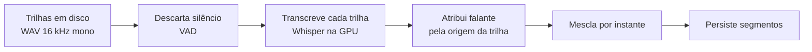

# Transcrição · Contrato

> **Versão:** 1.3 · **Última atualização:** 2026-08-19
> Decisões correspondentes: [0001](adr/0001-captura-local-duas-trilhas.md), [0002](adr/0002-faster-whisper-local.md), [0014](adr/0014-worker-em-container-com-gpu.md)

## 1. Pipeline



O pipeline recebe **uma lista de trilhas**, nunca um número fixo. Gravação ao vivo entrega duas; importação entrega uma. Essa é a única razão pela qual UC-04 não exige reescrever nada.

## 2. Captura

| Parâmetro | Valor | Razão |
|---|---|---|
| Taxa de amostragem | 16 kHz | É o que o modelo consome. Gravar acima só gasta disco e obriga a reamostrar |
| Canais | 1 por trilha | Voz não se beneficia de estéreo |
| Formato | WAV PCM 16 bits | Sem compressão durante a captura: codificar em tempo real arrisca a única etapa irreversível |
| Escrita | Incremental, em blocos | A reunião nunca fica acumulada em memória (RNF-P03) |

Duas trilhas, uma por origem:

| Trilha | Origem | Falante |
|---|---|---|
| `voce.wav` | Microfone | `voce` |
| `outros.wav` | Loopback da saída | `outros` |

**A atribuição de falante vem da origem do sinal, nunca de análise de conteúdo** (RN-01). É por isso que o sistema não precisa de diarização: a separação já aconteceu no hardware, e é exata por construção.

Custo em disco: cerca de 115 MB por hora por trilha; 230 MB por hora de reunião. Tratado pela política de retenção ([08-modelo-de-dados.md](08-modelo-de-dados.md) §8).

## 3. Modelo

| Item | Escolha |
|---|---|
| Implementação | `faster-whisper`, sobre CTranslate2 |
| Modelo | `large-v3` |
| Quantização | `int8_float16` |
| Idioma | Fixado em português, não detectado automaticamente |
| Detecção de fala | Ativada, para descartar silêncio |

**Idioma fixo é decisão, não descuido.** Detecção automática erra em áudio curto ou ruidoso, e a consequência é um trecho transcrito no idioma errado. O uso é monolíngue.

**Detecção de fala é obrigatória por causa da trilha de loopback**, que fica em silêncio sempre que ninguém além do usuário fala. Submeter silêncio ao modelo desperdiça tempo e induz alucinação: texto inventado em trecho mudo é falha conhecida do Whisper.

### 3.1 Memória de vídeo

A GPU tem 8 GB, mas o desktop do Windows já consome ~1,5 a 2 GB (medido), então o orçamento real é de **~6,3 GB**. `large-v3` quantizado ocupa 4 a 5 GB disso, cabe, mas **com pouca folga**. O modelo de linguagem do resumo disputa a mesma memória, e é por isso que o resumo automático só dispara **depois** que a transcrição libera o modelo ([07-arquitetura.md](07-arquitetura.md) §3).

Faltando memória, o worker tenta uma vez com configuração menor antes de desistir. Desistindo, marca falha e **preserva o áudio**: a reunião continua elegível a reprocessamento (UC-05, FE-01).

**Esse caminho de exceção não é raro.** Com margem estreita, basta abrir mais abas do navegador ou um jogo durante a transcrição para estourar. A nova tentativa com configuração menor deve ser tratada como comportamento esperado, não como último recurso.

## 4. Vocabulário de domínio

O modelo aceita um texto de contexto que influencia grafia de termos técnicos e nomes próprios (RF-13). É o mecanismo que faz nomes de clínicas, medicamentos e termos da área saírem escritos corretamente em vez de foneticamente aproximados.

**Aqui é onde o projeto se diferencia das ferramentas de mercado.** Elas transcrevem português genérico; nenhuma permite ensinar o vocabulário de um domínio. O ganho é medido no plano de testes, comparando WER com e sem vocabulário na mesma reunião.

O vocabulário fica em configuração, editável sem tocar em código.

## 5. Mesclagem

Transcritas as trilhas separadamente, os segmentos são unidos em ordem cronológica pelo instante de início. Como os relógios das duas trilhas partem do mesmo instante de gravação, não há necessidade de alinhamento.

Sobreposição de fala, os dois falando ao mesmo tempo, produz segmentos com intervalos que se cruzam. Isso é preservado, não resolvido: é o que de fato aconteceu, e a ordenação por início mantém a leitura coerente.

## 6. Desempenho

RNF-P01 exige transcrever mais rápido que o tempo real. Com `large-v3` quantizado em RTX 4060, a folga esperada é confortável, mas o número é **medido, não presumido**: a linha de base é estabelecida no primeiro teste com reunião real ([14-plano-de-testes.md](14-plano-de-testes.md)).

Duas trilhas dobram o trabalho, mas a detecção de fala remove boa parte: a trilha `voce` é majoritariamente silêncio quando os outros falam, e vice-versa.

## 7. Processo do worker

**Sem broker.** A fila é a própria coluna `meetings.status`, consultada com `FOR UPDATE SKIP LOCKED` — o mesmo mecanismo já usado pelo worker de resumo ([08-modelo-de-dados.md](08-modelo-de-dados.md) §5.2). O worker fala direto com o Postgres, não com a API.

```
enquanto verdadeiro:
    reunião ← seleciona (status='recorded', ORDER BY started_at,
                          FOR UPDATE SKIP LOCKED, LIMIT 1)
    se não há reunião:
        dorme WORKER_POLL_INTERVAL_SECONDS
        continua
    processa(reunião)
```

**A fila só olha `recorded`.** Uma reunião em `transcription_failed` não volta pra fila sozinha — fica parada, com o áudio intacto, até `cronista reprocessar <id>` (§10) trazê-la de volta a `recorded`. É o mesmo caminho, com o mesmo rótulo "reprocessar", que uma reunião já transcrita com sucesso usa pra ser refeita ([08-modelo-de-dados.md](08-modelo-de-dados.md) §5, diagrama de estados) — um único comando cobre os dois casos, não uma retentativa automática silenciosa que poderia martelar a GPU repetidamente sem o usuário perceber.

**Ciclo de uma reunião:**

1. `status → transcribing`, com commit imediato — deixa o estado visível mesmo sem concorrência real hoje, e é o que a recuperação de inicialização (abaixo) enxerga se o processo cair no meio.
2. Lê cada trilha do disco a partir de `DATA_ROOT/recordings/<audio_dir>/<path>` (mesma convenção do cliente e da API, [08-modelo-de-dados.md](08-modelo-de-dados.md) §2).
3. Transcreve cada trilha (§1 a §4 deste documento).
4. Mescla os segmentos em ordem cronológica (§5).
5. Persiste os segmentos, substituindo os de uma tentativa anterior se houver (§10).
6. `status → transcribed`.

**Falha em qualquer passo de 2 a 5:** `status → transcription_failed`, a mensagem de erro grava em `meetings.error`, e os arquivos de áudio permanecem intocados — a transcrição nunca escreve nem apaga nada em `recordings/` (RNF-R03).

**Recuperação na inicialização (CT-19).** Antes de entrar no loop, o worker roda:

```sql
UPDATE meetings SET status = 'recorded' WHERE status = 'transcribing';
```

Sem isso, uma reunião cujo worker caiu no meio da transcrição ficaria presa em `transcribing` para sempre — só o processo que morreu saberia tirá-la de lá.

## 8. Configuração

| Variável | Padrão | Papel |
|---|---|---|
| `WHISPER_MODEL` | `large-v3` | Modelo `faster-whisper` (§3) |
| `WHISPER_COMPUTE_TYPE` | `int8_float16` | Quantização (§3) |
| `WHISPER_LANGUAGE` | `pt` | Idioma fixo, sem detecção automática (§3) |
| `WHISPER_IDLE_UNLOAD_SECONDS` | `300` | Ociosidade antes de descarregar o modelo da VRAM ([ADR-0014](adr/0014-worker-em-container-com-gpu.md)) |
| `WHISPER_VOCABULARY` | vazio | Vocabulário de domínio, separado por vírgula (§4, RF-13) |
| `WHISPER_FALLBACK_COMPUTE_TYPE` | `int8` | Quantização de segunda tentativa em falta de memória (§9) |
| `WORKER_POLL_INTERVAL_SECONDS` | `5` | Intervalo entre consultas à fila quando vazia |

Vive em `WorkerSettings` (`cronista/core/config.py`), seguindo a mesma lógica de separação já documentada nesse módulo: o worker precisa do banco e de `DATA_ROOT` pra ler as trilhas, mas não dos segredos de autenticação da API (`JWT_SECRET`, `AUTH_PASSWORD_HASH`).

**Dentro do container, `DATA_ROOT` aponta para `/data`, não para o caminho do Windows.** O `docker-compose.yml` monta `${DATA_ROOT}:/data:ro` (a raiz do host, lida do `.env`, é só o *lado esquerdo* do bind mount) — a variável de ambiente que o worker lê de dentro do container é `/data`, um valor fixo, não a reinterpolação de `${DATA_ROOT}`. Ver §7 passo 2.

## 9. Memória insuficiente: uma nova tentativa (§3.1)

> **Status: implementado** (`cronista/worker/model_manager.py`, `ModelManager`). Descarregar por ociosidade (§8) e a retentativa por falta de memória (esta seção) ficam no mesmo componente, porque as duas mexem no mesmo ciclo de vida do modelo.

O mecanismo é fixado aqui; os valores exatos (RTX 4060, `large-v3`) já estão medidos e registrados em §3.1. Ao encontrar erro de memória insuficiente da GPU — seja carregando o modelo, seja durante a transcrição — o worker tenta **uma única vez** recarregar com `WHISPER_FALLBACK_COMPUTE_TYPE` antes de desistir. Nunca entra em loop de retentativa.

**A segunda tentativa troca só a quantização, nunca o modelo.** Cair para um modelo menor que `large-v3` mudaria a qualidade da transcrição de um jeito que o usuário não pediu; uma quantização mais leve é uma degradação mais previsível e reversível — a próxima transcrição, com mais memória livre, volta a usar a configuração normal.

Se a segunda tentativa também falhar, é uma falha como qualquer outra (§7): `status → transcription_failed`, erro registrado, áudio preservado (CT-18). `ModelManager.reload_with_fallback()` levanta `FallbackExhausted` nesse caso, capturado pelo tratamento genérico de falha do `process_meeting`.

**Detecção de falta de memória é por mensagem, não por classe de exceção.** O ctranslate2 não expõe um tipo próprio pra isso — só um `RuntimeError` com o texto do erro CUDA embutido (`is_out_of_memory()`, busca case-insensitive por "out of memory"). Testado com mensagens sintéticas, não contra uma falta de memória real de GPU: a RTX 4060 desta máquina tem folga hoje (§3.1), e forçar um OOM de propósito é arriscado/pouco confiável de reproduzir. O que **foi** medido de verdade em GPU real é o ciclo de carregar/descarregar por ociosidade (§8) — carga fria ~106s, carga com cache quente ~7s, descarregamento e recarga confirmados no container.

## 10. Reprocessamento (RF-15, CT-20)

> **Status: implementado.** `POST /meetings/{id}/transcribe` (`cronista/api/routes/meetings.py`), `Meeting.is_reprocessable()` (`cronista/core/models.py`), comando `cronista reprocessar <id>` (`cronista/client/cli.py`). Validado de ponta a ponta contra infraestrutura real: reunião real reprocessada via CLI → API → banco (status `transcribed` → `recorded`), depois pega pelo worker de verdade e retranscrita, com os segmentos substituídos.

`cronista reprocessar <id>` ([11-cli.md](11-cli.md) §2) devolve a reunião a `recorded`, tornando-a elegível ao worker de novo (`Meeting.is_reprocessable()`). Cobre os dois casos em que isso faz sentido:

- **`transcription_failed`** — a tentativa anterior não deu certo (falta de memória, por exemplo); o áudio está intacto (§7), só falta pedir de novo.
- **`transcribed` ou `summarized`** — a transcrição já teve sucesso, mas o usuário quer refazer (depois de ajustar `WHISPER_VOCABULARY`, por exemplo).

Chamado numa reunião em qualquer outro estado (`registering`, `transcribing`, `summary_failed`), recusa com código de saída `5` ("operação incompatível com o estado da reunião", [11-cli.md](11-cli.md) §4) — não tem o que reprocessar ainda, ou já tem outra operação em andamento.

**Reprocessar substitui os segmentos antigos, nunca acumula.** Antes de persistir os novos, o worker apaga todos os `segments` daquela `meeting_id`, na mesma transação que insere os novos — não há tentativa de casar segmento antigo com segmento novo por posição, porque a contagem e os limites dos segmentos mudam de uma transcrição pra outra (parâmetro de VAD diferente, vocabulário diferente, etc.). Trocar tudo de uma vez, dentro de uma transação, é o que evita um estado intermediário com segmentos de duas transcrições misturados.

## 11. O que este documento não fixa

Valores exatos de parâmetro do modelo: tamanho de janela, limiares de detecção de fala, número de candidatos. Esses se acertam medindo WER em áudio real, não decidindo antes ([14-plano-de-testes.md](14-plano-de-testes.md), CT-36).

O que está fixado é o que muda a arquitetura: formato de captura, quantidade variável de trilhas, origem da atribuição de falante, a regra de que falha nunca destrói áudio, o mecanismo de fila sem broker, a recuperação de worker interrompido, e a substituição atômica de segmentos no reprocessamento.
