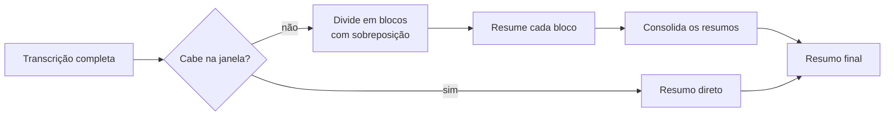

# Resumo · Contrato

> **Versão:** 1.2 · **Última atualização:** 2026-08-22
> Decisão correspondente: [0005](adr/0005-langchain-na-camada-de-resumo.md)

## 1. Papel

Transformar a transcrição, texto longo, cheio de hesitação e repetição, em um documento que responda o que ficou decidido e o que ficou pendente. É o entregável que o usuário efetivamente lê; a transcrição é matéria-prima.

## 2. Formato de saída

Markdown, com quatro seções fixas (RF-16):

| Seção | Conteúdo |
|---|---|
| **Pauta** | Assuntos tratados, na ordem em que apareceram |
| **Decisões** | O que foi decidido, com quem decidiu quando identificável |
| **Pendências** | Ações combinadas, **cada uma com responsável** e prazo quando houver |
| **Pontos em aberto** | O que foi levantado e não se resolveu |

**Responsável na pendência é requisito, não estilo.** Um resumo que lista "revisar o contrato" sem dizer de quem é a tarefa não substitui a ata que ele pretende substituir. É também o critério mais objetivo da rubrica de avaliação ([14-plano-de-testes.md](14-plano-de-testes.md)).

Seção sem conteúdo aparece vazia e explícita, nunca omitida: o leitor precisa distinguir "não houve decisão" de "o modelo esqueceu de listar".

## 3. Provedores

| Provedor | Papel | Consequência |
|---|---|---|
| **Ollama, local** | Padrão | Custo zero, sem limite, nada sai da máquina (RNF-C01, RNF-C04) |
| **Claude, remoto** | Opcional, por seleção explícita | Melhor qualidade em pt-BR; a transcrição sai da máquina e há custo |

O padrão é local porque é ele que cumpre a promessa que originou o projeto: sem cota e sem mensalidade. O provedor remoto existe para reuniões em que a qualidade justifique a troca, e para servir de referência de comparação.

Trocar de provedor não altera código fora desta camada (RNF-S04).

**Qual modelo do Ollama usar segue em aberto**, e se decide medindo em português real, não escolhendo antes.

## 4. Orquestração

A camada usa **LangChain**, com as integrações de cada provedor.

> **Registro honesto:** esta escolha foi recomendada contra durante o planejamento. Uma chamada única não costuma justificar um framework de orquestração, e há risco de conflito de dependência com o motor de transcrição. O usuário decidiu adotá-la deliberadamente, para aprender o framework em um ponto de baixo risco do sistema. O raciocínio completo, com o gatilho de reversão, está no [ADR-0005](adr/0005-langchain-na-camada-de-resumo.md). Este documento segue a decisão sem reabri-la.

Consequência prática já prevista: se as dependências conflitarem com `ctranslate2`, o worker de transcrição ganha ambiente próprio, o que a arquitetura de processos separados já deixa barato ([07-arquitetura.md](07-arquitetura.md) §7).

> **Status: implementado, etapas 1-2** (`cronista/api/summarize.py`, função `summarize()`). Escolha de provedor por `ChatOllama`/`ChatAnthropic` do LangChain, com `provider` sobrepondo `Settings.llm_provider` por execução (RF-18). Testado com `BaseChatModel` mockado (`tests/test_summarize.py`) — cobre as quatro seções, não sobrescrita (RN-03), resposta malformada e provedor indisponível (§7), e a transição de estado `summary_failed` → elegível de novo (`Meeting.is_summarizable()` em `cronista/core/models.py`). **Endpoint e CLI ligados** (`POST /meetings/{id}/summarize` em `cronista/api/routes/meetings.py`, `cronista resumir <id>` em `cronista/client/cli.py`), com `503` para provedor indisponível/resposta malformada e timeout do cliente estendido pra 300s (uma chamada de LLM real não cabe nos 10s padrão dos outros endpoints). **Ainda não validado contra Ollama real** — isso é a próxima etapa (docs/15-roadmap.md, Fase 4).

## 5. Transcrições longas

Uma reunião de duas horas excede a janela de contexto de modelos locais. RF-17 exige processar sem truncar.

A divisão respeita fronteira de segmento e mantém sobreposição entre blocos, para não cortar uma decisão ao meio. Truncar é proibido: perder o fim da reunião perderia justamente onde as decisões costumam ser fechadas.

O limiar exato e o tamanho de bloco dependem do modelo escolhido, e ficam em configuração.

## 6. Prompts versionados

Cada resumo persiste o provedor, o modelo e a **versão do prompt** que o gerou ([08-modelo-de-dados.md](08-modelo-de-dados.md) §4.4).

Isso existe para tornar a melhoria mensurável. Alterar o prompt e não registrar qual gerou o quê torna impossível saber se a mudança melhorou ou piorou, e "o resumo ficou melhor que o do Notion" é o critério de sucesso do projeto, não uma impressão.

Resumos nunca são sobrescritos (RN-03). Gerar de novo acrescenta; a comparação lado a lado é o objetivo.

## 7. Falhas

| Falha | Comportamento |
|---|---|
| Provedor indisponível | Informa qual provedor e como iniciá-lo. **Nenhum resumo parcial é gravado** |
| Resposta fora do formato | Guarda a resposta bruta para diagnóstico e reporta falha |
| Tempo limite | Encerra a espera; a reunião continua elegível a nova tentativa |
| Reunião sem segmentos | Recusa com estado incompatível, sem chamar o modelo |

O princípio: **nunca persistir resumo malformado como se fosse válido.** Um resumo errado é pior que resumo nenhum, porque é lido como verdade.

## 8. O que este documento não fixa

O texto dos prompts, o modelo do Ollama, valores de temperatura, tamanho de bloco e limiar de divisão. Todos dependem de medição em português real: decidi-los agora seria adivinhação registrada como especificação.

O que está fixado: o formato de saída, a exigência de responsável nas pendências, a proibição de truncar, o versionamento que torna a comparação possível, e a regra de nunca gravar resumo malformado.
