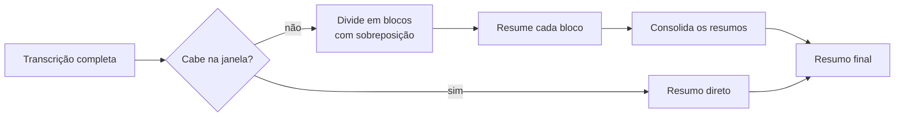

# Resumo · Contrato

> **Versão:** 1.6 · **Última atualização:** 2026-08-22
> Decisão correspondente: [0005](adr/0005-langchain-na-camada-de-resumo.md)

## 1. Papel

Transformar a transcrição, texto longo, cheio de hesitação e repetição, em um documento que responda o que ficou decidido e o que ficou pendente. É o entregável que o usuário efetivamente lê; a transcrição é matéria-prima.

## 2. Formato de saída

Markdown, com quatro seções fixas (RF-16):

| Seção | Conteúdo |
|---|---|
| **Pauta** | Assuntos tratados, na ordem em que apareceram |
| **Decisões** | O que foi decidido, com quem decidiu quando identificável |
| **Pendências** | Ações combinadas, **cada uma com responsável** e prazo quando houver |
| **Pontos em aberto** | O que foi levantado e não se resolveu |

**Responsável na pendência é requisito, não estilo.** Um resumo que lista "revisar o contrato" sem dizer de quem é a tarefa não substitui a ata que ele pretende substituir. É também o critério mais objetivo da rubrica de avaliação ([14-plano-de-testes.md](14-plano-de-testes.md)).

Seção sem conteúdo aparece vazia e explícita, nunca omitida: o leitor precisa distinguir "não houve decisão" de "o modelo esqueceu de listar".

## 3. Provedores

| Provedor | Papel | Consequência |
|---|---|---|
| **Ollama, local** | Padrão | Custo zero, sem limite, nada sai da máquina (RNF-C01, RNF-C04) |
| **Claude, remoto** | Opcional, por seleção explícita | Melhor qualidade em pt-BR; a transcrição sai da máquina e há custo |

O padrão é local porque é ele que cumpre a promessa que originou o projeto: sem cota e sem mensalidade. O provedor remoto existe para reuniões em que a qualidade justifique a troca, e para servir de referência de comparação.

Trocar de provedor não altera código fora desta camada (RNF-S04).

**Qual modelo do Ollama usar segue em aberto**, e se decide medindo em português real, não escolhendo antes.

## 4. Orquestração

A camada usa **LangChain**, com as integrações de cada provedor.

> **Registro honesto:** esta escolha foi recomendada contra durante o planejamento. Uma chamada única não costuma justificar um framework de orquestração, e há risco de conflito de dependência com o motor de transcrição. O usuário decidiu adotá-la deliberadamente, para aprender o framework em um ponto de baixo risco do sistema. O raciocínio completo, com o gatilho de reversão, está no [ADR-0005](adr/0005-langchain-na-camada-de-resumo.md). Este documento segue a decisão sem reabri-la.

Consequência prática já prevista: se as dependências conflitarem com `ctranslate2`, o worker de transcrição ganha ambiente próprio, o que a arquitetura de processos separados já deixa barato ([07-arquitetura.md](07-arquitetura.md) §7).

> **Status: implementado, etapas 1-3** (`cronista/api/summarize.py`, função `summarize()`). Escolha de provedor por `ChatOllama`/`ChatAnthropic` do LangChain, com `provider` sobrepondo `Settings.llm_provider` por execução (RF-18). Testado com `BaseChatModel` mockado (`tests/test_summarize.py`) — cobre as quatro seções, não sobrescrita (RN-03), resposta malformada e provedor indisponível (§7), e a transição de estado `summary_failed` → elegível de novo (`Meeting.is_summarizable()` em `cronista/core/models.py`). Endpoint e CLI ligados (`POST /meetings/{id}/summarize`, `cronista resumir <id>`), com `503` para provedor indisponível/resposta malformada e timeout do cliente estendido pra 300s.
>
> **Validado contra Ollama real em 2026-08-22** (`llama3.1:8b`, primeiro candidato — RTX 4060, 6,9 GB livres, folga confortável pro tamanho do modelo). Achado real, não presumido: a reunião do CT-16/36 (fala real + YouTube misturado) foi **recusada pelo modelo** — os filtros de segurança do Llama trataram o conteúdo informal como controverso. Validado então com uma transcrição sintética (reunião fictícia, tom normal), com três rodadas de prompt:
>
> - **v1** (original): "Pendências" saía vazio mesmo com ação combinada real; o modelo classificava isso como Decisão e não ligava "eu fico responsável" a quem estava falando.
> - **v2** (instrução explícita sobre primeira pessoa e a diferença Decisão/Pendência): melhorou o reconhecimento de "eu" como o falante, mas Pendências continuou vazio.
> - **v3** (mesma instrução + um exemplo de poucas linhas embutido no prompt, mostrando a diferença Decisão/Pendência num caso concreto): **corrigiu** — Pendências passou a sair certo, com os dois responsáveis corretamente identificados. Ficou um resíduo menor: Decisões às vezes inclui uma frase inferida que não foi dita desse jeito na transcrição (não é fabricação de fato, é excesso de síntese) — não bloqueante, registrado pra acompanhar quando houver reunião real pra medir (CT-37).
>
> **v4** (2026-08-22, medido contra a primeira reunião real de domínio disponível — migração de dados clínicos do iClinic, ~21 mil caracteres, forçou o caminho de blocos do RF-17 em escala real): reforçou "Decisões" pra reconhecer o padrão pergunta→explicação→concordância, não só "decidimos X" explícito, e adicionou instrução redobrada sobre preservar negação. Corrigiu a inversão do financeiro (antes dizia "importar", correto agora é "não importar") e tirou "Decisões" do vazio — mas a decisão sobre agenda sumiu inteira na consolidação (antes aparecia invertida, agora nem aparece), e duas decisões vieram com justificativa que a transcrição não sustenta. Detalhe completo em [15-roadmap.md](15-roadmap.md), Fase 4.
>
> `PROMPT_VERSION` está em v4. Modelo (`llama3.1:8b`) segue como primeiro candidato, não uma escolha final — três rodadas de ajuste em cima da mesma reunião real cada uma resolveu um problema e revelou outro, sinal de estar perto do limite do que um modelo de 8B parâmetros faz de forma confiável nessa tarefa. Comparação com outros modelos e a rubrica comparativa (CT-37) seguem pendentes.
>
> **Causa raiz encontrada, não era o modelo nem o prompt.** `summary_context_chars=12.000` tinha sido calibrado em cima do `default_num_ctx=4096` que o Ollama escolhe sozinho -- forçando divisão em blocos numa reunião que não precisava dividir. `ollama_num_ctx=8192` + `summary_context_chars=24.000` (`cronista/core/config.py`) eliminam a divisão pra reuniões de até ~1h de fala densa, medido contra RTX 4060 8GB sem derramar pra CPU (~11s de resposta). A decisão sobre agenda, que sumia em toda consolidação testada hoje, voltou a aparecer numa chamada só. Três variantes de formatação apareceram no processo (nível 3, `### ##` colado, negrito) -- `_normalizar_titulos()` generalizou pra aceitar qualquer nível/negrito reconhecível em vez de perseguir cada variante. Detalhe completo, incluindo a pesquisa que embasou a mudança (map-reduce vs. refine, negação como fraqueza documentada de LLM), em [15-roadmap.md](15-roadmap.md), Fase 4.

> **Status: implementado, etapa 4** (`cronista/api/summarize.py`, `_dividir_em_blocos()` + `_PROMPT_CONSOLIDACAO`). Transcrição maior que `Settings.summary_context_chars` (heurística de caracteres, padrão 12.000 — medido contra o `default_num_ctx=4096` que o Ollama relatou pro `llama3.1:8b` nesta máquina) divide respeitando fronteira de segmento, com sobreposição configurável (`summary_block_overlap_segments`), resume cada bloco com o mesmo prompt principal, e consolida com um prompt dedicado. Testado com mock (blocos corretos, sem perder segmento, sobreposição real, falha em qualquer chamada marca `summary_failed`) e **validado contra Ollama real**: o mecanismo funciona (múltiplas chamadas, consolidação real), mas com um limite artificialmente baixo (200 caracteres, só pra forçar fragmentação extrema num teste manual) a qualidade da consolidação degradou — itens duplicados, um item mal classificado dentro da seção errada. Não é evidência de que o padrão de 12.000 caracteres (blocos bem maiores, poucos por reunião real) tenha o mesmo problema; não foi medido nesse tamanho por falta de reunião real longa disponível. Achado colateral, real: o mesmo teste expôs que a validação de formato aceitava `### Pauta` (nível 3) por engano, porque `"## Pauta"` é substring de `"### Pauta"` — corrigido pra exigir o título exatamente em nível 2 (`tests/test_summarize.py::test_summarize_titulo_em_nivel_errado_e_malformado`).

> **Status: implementado, etapa 5 — resumo automático pós-transcrição.** Mecanismo, autenticação e validação de ponta a ponta documentados em [07-arquitetura.md](07-arquitetura.md) §3, junto da restrição de VRAM que o motiva.

## 5. Transcrições longas

Uma reunião de duas horas excede a janela de contexto de modelos locais. RF-17 exige processar sem truncar.

A divisão respeita fronteira de segmento e mantém sobreposição entre blocos, para não cortar uma decisão ao meio. Truncar é proibido: perder o fim da reunião perderia justamente onde as decisões costumam ser fechadas.

O limiar exato e o tamanho de bloco dependem do modelo escolhido, e ficam em configuração.

## 6. Prompts versionados

Cada resumo persiste o provedor, o modelo e a **versão do prompt** que o gerou ([08-modelo-de-dados.md](08-modelo-de-dados.md) §4.4).

Isso existe para tornar a melhoria mensurável. Alterar o prompt e não registrar qual gerou o quê torna impossível saber se a mudança melhorou ou piorou, e "o resumo ficou melhor que o do Notion" é o critério de sucesso do projeto, não uma impressão.

Resumos nunca são sobrescritos (RN-03). Gerar de novo acrescenta; a comparação lado a lado é o objetivo.

## 7. Falhas

| Falha | Comportamento |
|---|---|
| Provedor indisponível | Informa qual provedor e como iniciá-lo. **Nenhum resumo parcial é gravado** |
| Resposta fora do formato | Guarda a resposta bruta para diagnóstico e reporta falha |
| Tempo limite | Encerra a espera; a reunião continua elegível a nova tentativa |
| Reunião sem segmentos | Recusa com estado incompatível, sem chamar o modelo |

O princípio: **nunca persistir resumo malformado como se fosse válido.** Um resumo errado é pior que resumo nenhum, porque é lido como verdade.

## 8. O que este documento não fixa

O texto dos prompts, o modelo do Ollama, valores de temperatura, tamanho de bloco e limiar de divisão. Todos dependem de medição em português real: decidi-los agora seria adivinhação registrada como especificação.

O que está fixado: o formato de saída, a exigência de responsável nas pendências, a proibição de truncar, o versionamento que torna a comparação possível, e a regra de nunca gravar resumo malformado.
